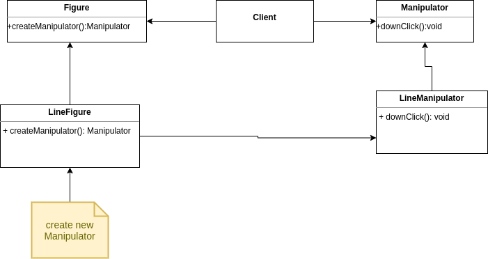
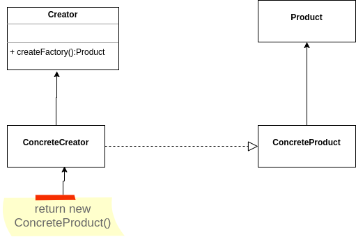
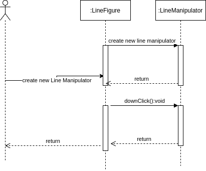
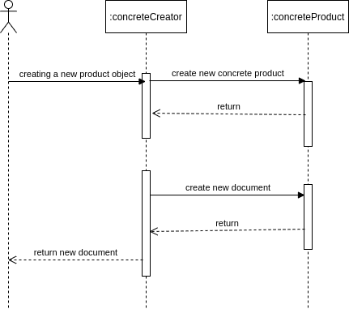

<h1 align="center">Welcome to Factory Method Design Pattern 👋</h1>

  
  
  
  
  

> Defines an interface to create an object, but let the subclasses decide which class to instantiate. The factory Method allows a class to defer instantiation of subclasses. (GOF,GAMMA 2008).

### 🏠 [Homepage](https://github.com/thiagoolsilva/design_patterns#readme)

## When to use Factory Method Design Pattern?

- A class cannot anticipate the class of objects it will create (GOF,GAMMA 2008) ;
- A class wants its subclasses to specify the objects they create (GOF,GAMMA 2008);
- Classes delegate responsibility to one of several auxiliary subclasses, and you want to find out which auxiliary subclass is the delegate (GOF,GAMMA 2008).

## Consequence:

- Positives: Loose coupling, greater flexibility and eliminates the need to couple specific classes for code-level application. (wikipedia,2020)
- Negatives: High number of classes, can overload the system. (wikipedia,2020).
- Provide hooks for subclasses. Creating objects inside a class with n factory method is always more flexible than creating an object directly. Factory Method gives subclasses a hook to provide an extended view of an object.  In the Documents example, the Document class could define a factory method called CreateFileDialog that creates a file dialog object by default to open an existing document.  A subclass of Document can define an application-specific file dialog by redefining this factory method. In this case, the factory method is not abstract, but it does provide a reasonable default implementation. (GOF,GAMMA 2008).
> This is the second approach implemented.
- Connect parallel class hierarchies. In the examples we've considered so far the factory method is only called by Creators.  But it doesn't have to be that way;  customers may find factory methods useful, especially in the case of parallel class hierarchies.  Parallel class hierarchies occur when a class delegates some of its responsibilities to a separate class.  Consider, for example, pictures that can be manipulated interactively;  that is, they can be stretched, moved or rotated using the mouse.  Implementing such interactions is not always easy.  This often requires storing and updating information that records the state of the manipulation at a certain point in time.  This state is only needed during manipulation;  therefore, it does not need to be kept in the picture-object.  Furthermore, different figures behave differently when manipulated by the user.  For example.  stretching a line can have the effect of moving one end, while stretching text can change its line spacing. (GOF,GAMMA 2008). 
> This is the first approach implemented.

## Who uses factory method design pattern?

- This pattern is often used in frameworks to define and maintain relationships between objects. The Spring framework, depending on the configuration, can use a Factory Method to create its beans. (Wikipedia, 2020)

## Diagram Class

### First approach

### Second approach

## Sequence Diagram

### First Approach

### Second approach

##  Links and Books

- [Design Pattern - GOF](https://www.amazon.com.br/Padr%C3%B5es-Projetos-Solu%C3%A7%C3%B5es-Reutiliz%C3%A1veis-Orientados/dp/8573076100/ref=sr_1_1?__mk_pt_BR=%C3%85M%C3%85%C5%BD%C3%95%C3%91&crid=17RQ9BFQP9EBV&keywords=padr%C3%B5es+de+projeto&qid=1636077027&s=books&sprefix=padr%C3%B5es+de+proje%2Cstripbooks%2C260&sr=1-1&ufe=app_do%3Aamzn1.fos.6a09f7ec-d911-4889-ad70-de8dd83c8a74)
- [Factory Method Wikipedia](https://pt.wikipedia.org/wiki/Factory_Method)
- [Factory Method Source Marking](https://sourcemaking.com/design_patterns/factory_method)
- [Factory Method Refactoring Guru](https://refactoring.guru/pt-br/design-patterns/factory-method)

## Author

👤 **Thiago Lopes da Silva <thiagoolsilva@gmail.com>**

* Website: https://medium.com/@thiagolopessilva
* Twitter: [@thiagoolsilva](https://twitter.com/thiagoolsilva)
* Github: [@thiagoolsilva](https://github.com/thiagoolsilva)
* LinkedIn: [@thiago-lopes-silva-2b943a25](https://linkedin.com/in/thiago-lopes-silva-2b943a25)

## 🤝 Contributing

Contributions, issues and feature requests are welcome! Feel free to check [issues page](https://github.com/thiagoolsilva/design_patterns/issues). You can also take a look at the [contributing guide](https://github.com/thiagoolsilva/design_patterns/blob/master/CONTRIBUTING.md).

## Show your support

Give a ⭐️ if this project helped you!

## 📝 License

Copyright © 2021 [Thiago Lopes da Silva <thiagoolsilva@gmail.com>](https://github.com/thiagoolsilva). 
This project is [APACHE--V2](https://github.com/thiagoolsilva/design_patterns/blob/master/LICENSE) licensed.

***
_This README was generated with ❤️ by [readme-md-generator](https://github.com/kefranabg/readme-md-generator)_