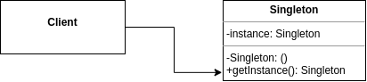
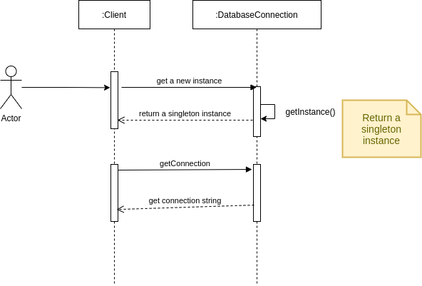

<h1 align="center">Welcome to Singleton Design Pattern 👋</h1>

  
  
  
  
  

> In software engineering, the singleton pattern is a software design pattern that restricts the instantiation of a class to one "single" instance. This is useful when exactly one object is needed to coordinate actions across the system. [wikipedia](https://en.wikipedia.org/wiki/Singleton_pattern)

### 🏠 [Homepage](https://github.com/thiagoolsilva/design_patterns#readme)

## When to use Singleton Design Pattern?

- There needs to be only one instance of a class and that instance has to give access to clients through a well-known point. (GOF,GAMMA 2008)
- The only instance has to be extensible through subclasses enabling customers to use an extended instance without changing its code. (GOF,GAMMA 2008)

## Consequence:

- Controlled access to single instance. Because the singleton class encapsulates its single instance, you have full control over what it's like when clients access it. (GOF,GAMMA 2008)
- Allows a variable number of instances. The pattern makes it easy to change your mind by allowing more than one instance of the Singleton class. Also, you can use the same approach to control the number of instances the application uses. Only the operation that allows access to the Singleton instance needs to be changed. (GOF,GAMMA 2008)

## Diagram Class

## Sequence Diagram

##  Links and Books

- [Design Pattern - GOF](https://www.amazon.com.br/Padr%C3%B5es-Projetos-Solu%C3%A7%C3%B5es-Reutiliz%C3%A1veis-Orientados/dp/8573076100/ref=sr_1_1?__mk_pt_BR=%C3%85M%C3%85%C5%BD%C3%95%C3%91&crid=17RQ9BFQP9EBV&keywords=padr%C3%B5es+de+projeto&qid=1636077027&s=books&sprefix=padr%C3%B5es+de+proje%2Cstripbooks%2C260&sr=1-1&ufe=app_do%3Aamzn1.fos.6a09f7ec-d911-4889-ad70-de8dd83c8a74)
- [Singleton Wikipedia](https://pt.wikipedia.org/wiki/Singleton)

## Author

👤 **Thiago Lopes da Silva <thiagoolsilva@gmail.com>**

* Website: https://medium.com/@thiagolopessilva
* Twitter: [@thiagoolsilva](https://twitter.com/thiagoolsilva)
* Github: [@thiagoolsilva](https://github.com/thiagoolsilva)
* LinkedIn: [@thiago-lopes-silva-2b943a25](https://linkedin.com/in/thiago-lopes-silva-2b943a25)

## 🤝 Contributing

Contributions, issues and feature requests are welcome! Feel free to check [issues page](https://github.com/thiagoolsilva/design_patterns/issues). You can also take a look at the [contributing guide](https://github.com/thiagoolsilva/design_patterns/blob/master/CONTRIBUTING.md).

## Show your support

Give a ⭐️ if this project helped you!

## 📝 License

Copyright © 2021 [Thiago Lopes da Silva <thiagoolsilva@gmail.com>](https://github.com/thiagoolsilva). 
This project is [APACHE--V2](https://github.com/thiagoolsilva/design_patterns/blob/master/LICENSE) licensed.

***
_This README was generated with ❤️ by [readme-md-generator](https://github.com/kefranabg/readme-md-generator)_